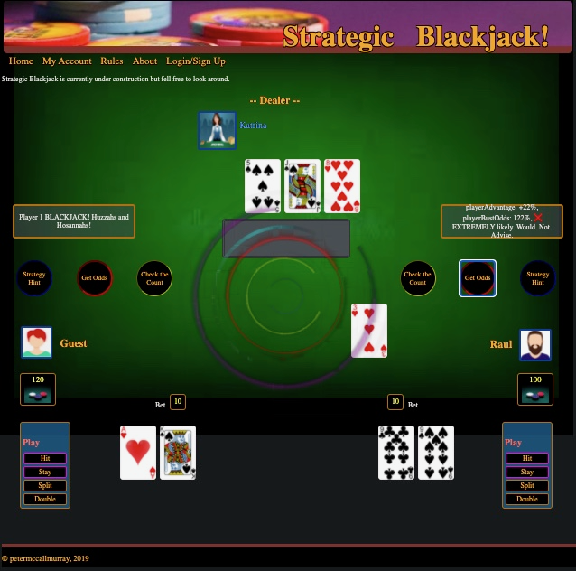

# Strategic BlackJack

# A Blackjack game to learn and refine Basic Strategy

#### To provide an easy interface with helpful information and hints about improving a player's betting odds using basic strategy in traditional blackjack games. To demonstrate some basic game logic and have an extendable platform to further implemet and explore the possiblities of a 'simple' card game's complexity.

#### Images

 {width="600", height="400"}

#### Gameplay

 * Standard Blackjack gameplay including betting options with two user-controlled players vs a dealer.
 * User can check strategy plays by checking Counted Cards, Bust Probability, and a Recommended Play according to basic strategy to get real time updates to learn and enhance their winning odds against the dealer and the table in any given situation.

#### Some features that are in the works

* Bug fixes
* Refine and extend gameplay
* Implement Split and Double betting options
* Refine and enhance implementation of the strategy algorithm using the dealer outcome probability hash-map.
* Incentivize "better" strategic play by tracking a users "Strategic Rating"
* Implement a pseudo or proto blockchain-like chip mining algorithm that mines chips and is optimized relative to a players rating further incentivizing learning "correct" strategic play.

#### Requirements
* Modern Browser (Chrome, Safari, Firefox, Opera, etc.)

#### Developed by Peter McCall Murray.

